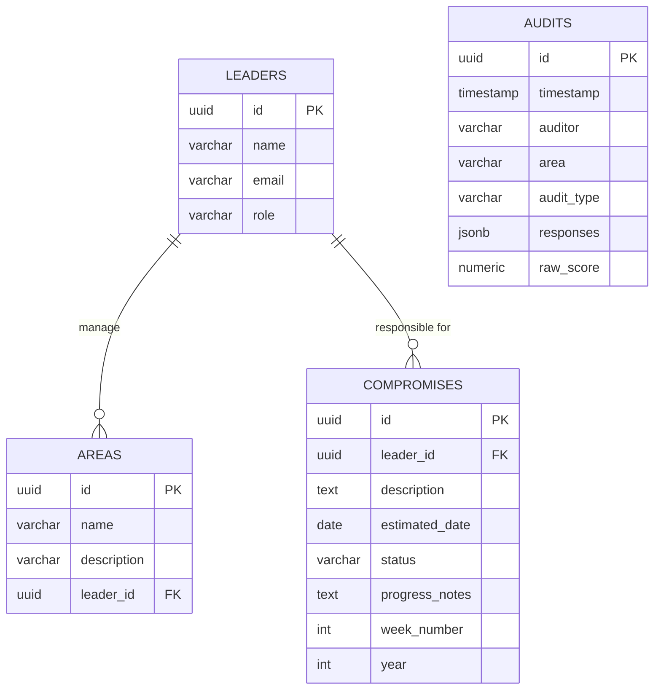

# Arquitectura de Base de Datos - Anfiteatro Dashboard

Esta documentación detalla el esquema relacional implementado en Supabase (PostgreSQL) para gestionar los datos del dashboard de auditorías.

## Resumen del Esquema

El modelo se divide en 4 tablas principales:
1. `audits`: Registro de todas las auditorías sincronizadas desde Google Forms.
2. `leaders`: Tabla de usuarios y roles dentro de la plataforma.
3. `areas`: Lugares físicos o conceptuales sujetos a evaluación, enlazados a un líder.
4. `compromises`: Metas o compromisos semanales fijados para un líder.

## Diagrama Entidad-Relación Lógico

## Detalles de las Tablas

### `audits`
Guarda el registro individual de cada evaluación. La columna más importante aquí es `responses` (tipo `JSONB`). Debido a que existen 13 formularios de auditorías distintos, cada uno con preguntas variadas, normalizar cada pregunta en una columna es inviable. El formato JSONB permite almacenar toda la data recolectada de forma flexible y ser consultada rápidamente mediante índices GIN.
- `timestamp`: Cuándo ocurrió.
- `auditor`: Quién la realizó.
- `area`: Lugar (ej. "Cocina", "Salón").
- `audit_type`: El formulario exacto utilizado (ej. "COCINA - AUDITORÍA GENERAL").
- `responses`: `{ "Pregunta 1": "Si", "Escala de Limpieza": 4, ... }`

### `leaders`
Almacena al personal administrativo y operativo que usa el dashboard.
- `role`: Roles en el sistema: `admin`, `wendy` (Visión Macro), `lider` (Visión Limitada a sus áreas), `benito` (Reporte Ejecutivo).

### `areas`
Cada área del Anfiteatro (Cavernas, Cocina, Salón, etc.) está registrada aquí y se le asocia un `leader_id` responsable de sus resultados.

### `compromises`
Registro de los acuerdos pactados semanalmente tras evaluar el estado actual de los KPIs.
- `status`: Puede ser `pending`, `in_progress`, `completed`, `blocked`.
- `week_number` y `year`: Para permitir análisis de tendencias y cumplimiento histórico.

## Índices
Se han creado índices clave para optimizar las consultas frecuentes del dashboard:
- Filtrado por fechas, auditores, áreas y tipos (`idx_audits_timestamp`, `idx_audits_area`, etc.).
- Filtrado profundo dentro del JSONB `responses` usando GIN.
- Búsqueda de compromisos por líder y estado.
